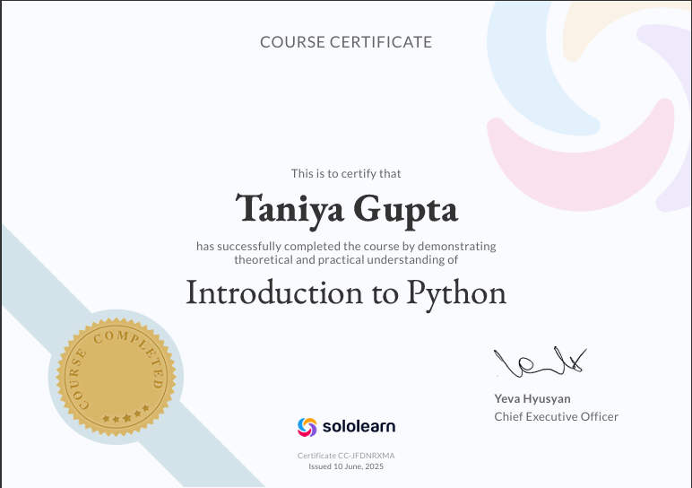
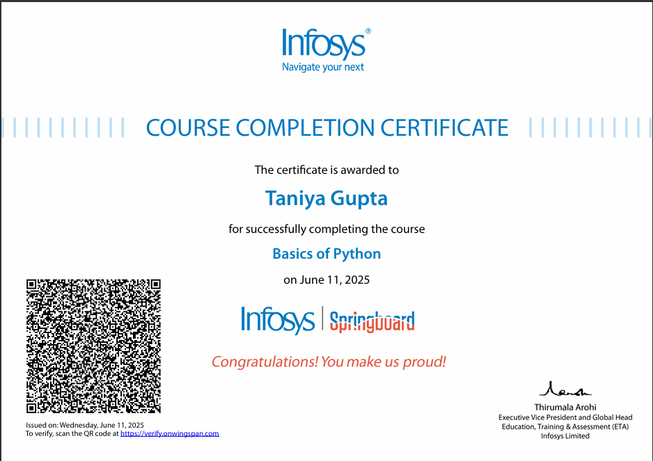
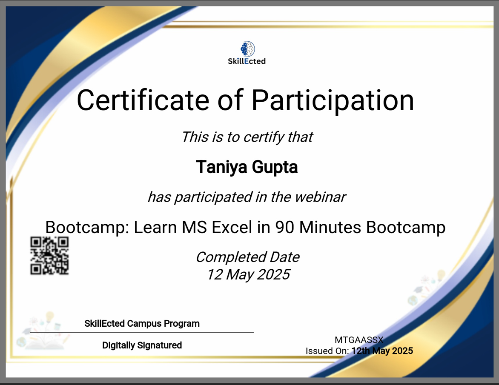
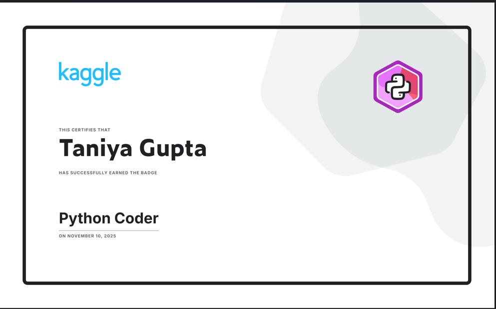
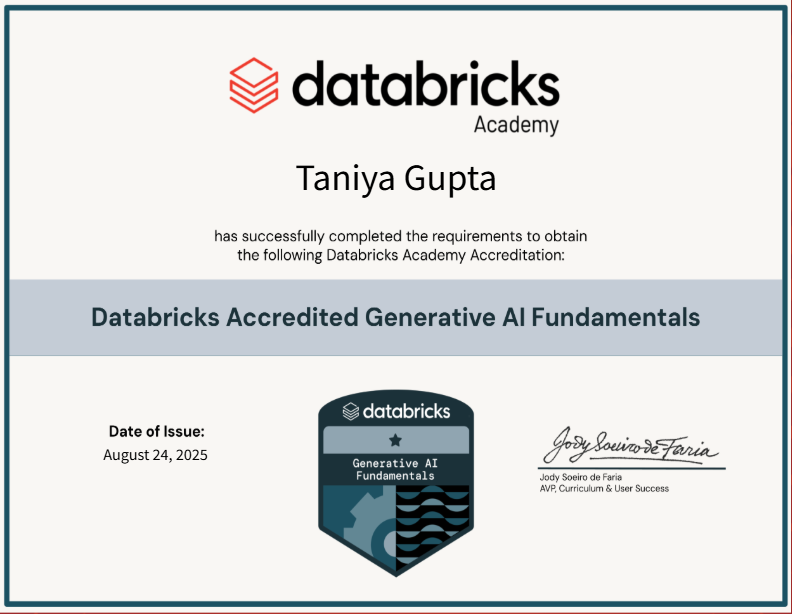
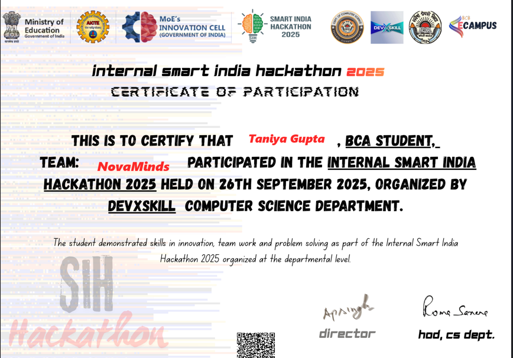

<h1 align="center">Hi 👋, I'm Taniya Gupta</h1>
<h3 align="center">BCA Student @Bareilly College | Full Stack Developer | Data Analyst | SIH Finalist</h3>

---

### 🚀 About Me  
- 🎓 BCA Student  
- 💻 Full Stack Web Developer  
- 📊 Data Analytics Learner  
- 🤖 AI/ML Enthusiast  
- 🏆 SIH 2025 Finalist  

---

### 🌐 Social Links  

---

### 🔧 Technologies & Tools  

---

## 🏅 Certificates

  <a href="Certificate1.png">
  <a href="certificate2.png">
  <a href="certificate3.png">
  <a href="certificate4.png">
  <a href="certificate5.png">
  <a href="certificate6.png">
  <a href="certificate7.png">
  <a href="SQLBadge 1.png">

---

### 🏆 Achievements  
- 🥇 SIH 2025 Grand Finale – Selected  
- 🧠 Created AI Projects  
- 📈 Completed 10+ Mini Projects  

---

### ✨ Fun Quote  
> “Code, Learn, Build, Repeat 🚀”
