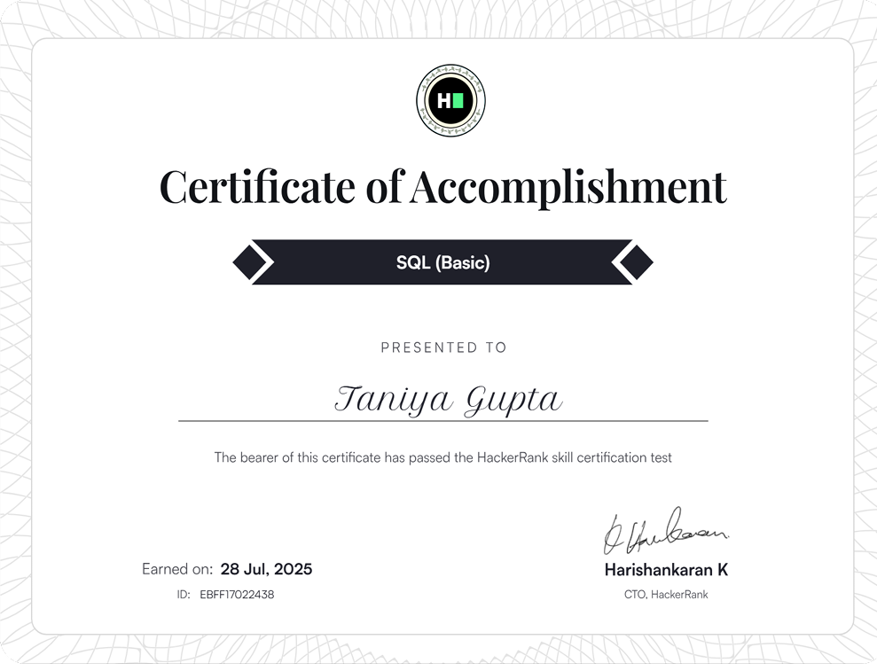
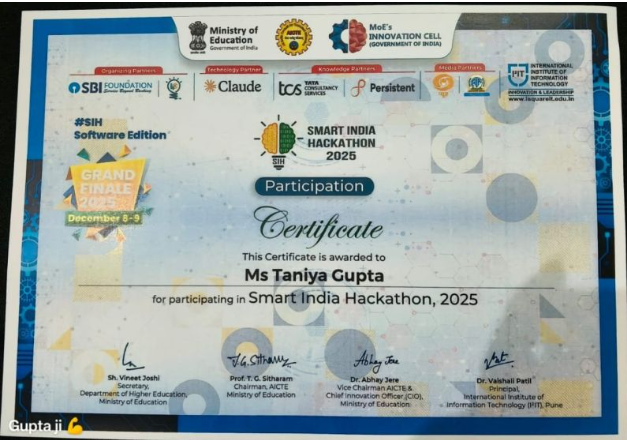

<h1 align="center">Hi 👋, I'm Taniya Gupta</h1>
<h3 align="center">BCA Student @Bareilly College | Frontend Developer | Data Analyst | SIH Finalist 2025</h3>

---

### 🚀 About Me  
- 🎓 BCA Student  
- 💻 Frontend Web Developer
- 📊 Data Analytics
- 🤖 AI/ML Enthusiast
- 📊 Data Science Learner
- 🏆 SIH 2025 Finalist  

---

### 🌐 Social Links  

---

### 🔧 Technologies & Tools 

<!-- Programming & Web -->

<!-- Libraries -->

<!-- Frameworks -->

<!-- Databases -->

<!-- Tools -->

<!-- Deployment & Version Control -->

---

<h3>🤖 AI Tools</h3>

---

## 🏅 Certificates

  <a href="Certificate1.png">
  <a href="certificate2.png">
  <a href="certificate9.png">
  <a href="certificate4.png">
  <a href="certificate10.png">
  <a href="certificate6.png">
  <a href="certificate12.png">
  <a href="certificate11.png">
  <a href="Certificate8.png">
  <a href="certificate7.png">
  <a href="certificate5.png">
  <a href="certificate3.png">
  <a href="SQLBadge 1">

---

### 🏆 Achievements  
- 🥇 SIH 2025 Grand Finale – Selected  
- 🧠 Created AI Projects  
- 📈 Completed 10+ Projects  

